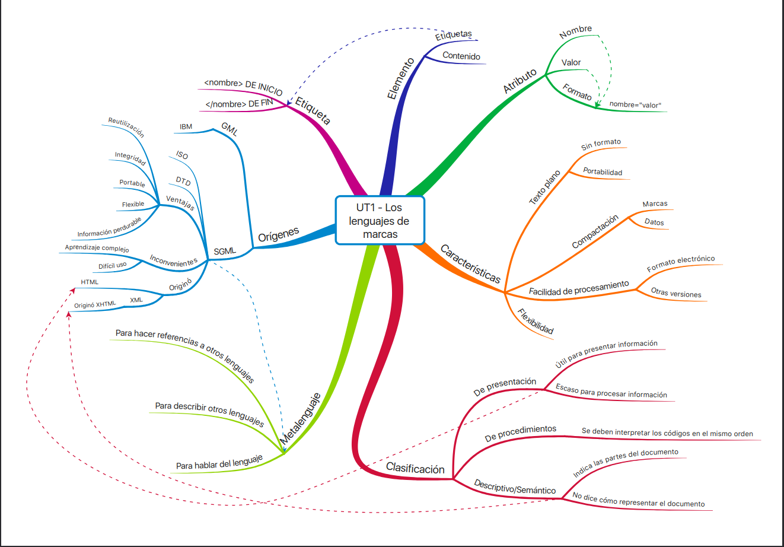

# Bitácora 1 Carlos GN (Septiembre)

# Día 1 - 15/9/25

1. [Presentación de Contenidos y Criterios de calificación](https://aula21-my.sharepoint.com/:p:/r/personal/miguel_trigueros_aulaxxi_murciaeduca_es/_layouts/15/Doc.aspx?sourcedoc=%7BCE62C3AD-BB90-4BDF-8868-C001EB7DB437%7D&file=LM%20-%20UT0%20-%20PRESENTACI%C3%93N.pptx&action=edit&mobileredirect=true)

2. Explicacion mápa mental 




```
Ese dia comenzamos hablando un poco de nosotros para conocernos y empezamos a hablar sobre con que criterios nos calificarias las tareas
```

Día 2 - 18/9/25 
===


Tarea 1 (Crea tu propia lenguaje de marcas)
---

>Con una breve expliación del tema de lenguaje de marcas, tuvimos que crear nuestro propio lenguaje de marcas si saber apenas como hacerlo, con su criterios y elementos.

<[Tarea 1](<../Tarea 1/LM0101_Lenguaje de Marcas Carlos GN-Intento2.pdf>)>

- Elemento            
  + Cosa
  * suma 

- Elemento            
  + Cosa
  * suma  
 
Letras y sosas

~~~ 
gsgsg
Y otra cosa de las mismas  
~~~

fsafsadkjfhsadfha
***
asdfsadjfsahkjfhsdafhsa

fsafsadkjfhsadfha
___
asdfsadjfsahkjfhsdafhsa

*fafa*

_fafa_

**fafa**

__faf__

***fafa*** 

___fafa___

lenguaje de programación [sintanxis de markdown](https://markdown.es/sintaxis-markdown/)


`lenguaje de codigo mostrado como lenguaje de código`

***

Esto es una


<https://markdown.es/sintaxis-markdown/>

\****______{[[{{{########}]]} ++ ·· !